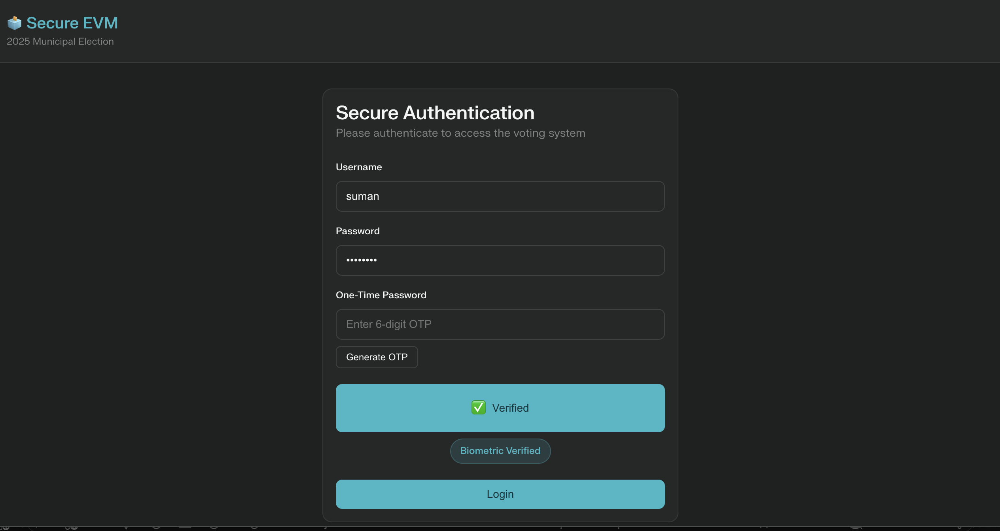
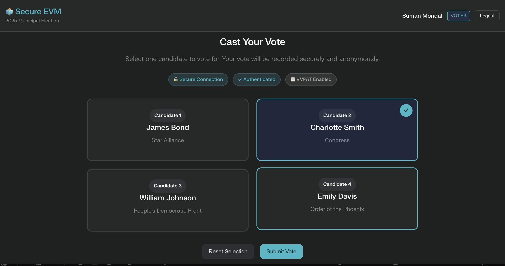
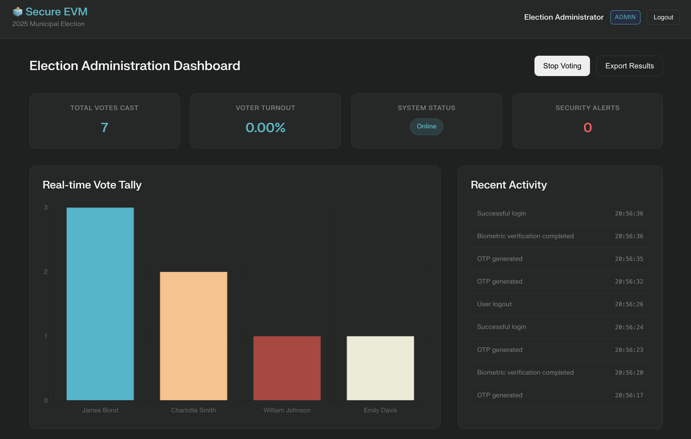
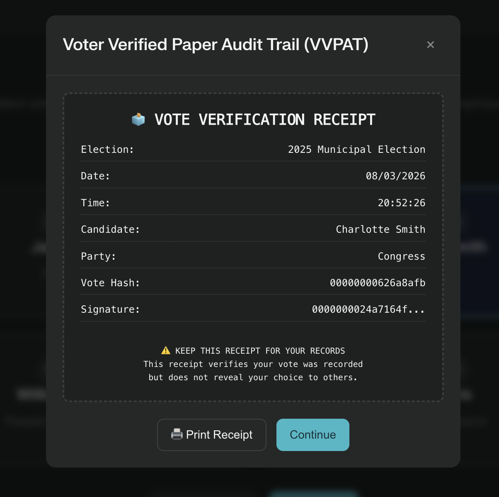

# 🗳️ Digital Voting System

A **Secure Electronic Voting Machine (EVM) Simulation** built using **Java Spring Boot, REST APIs, and a Web Interface**.

This project demonstrates a **digital voting workflow simulation** including **multi-factor authentication, vote integrity mechanisms, audit logging, and election monitoring dashboards**.

The system is designed to illustrate how modern electronic voting infrastructure can incorporate **security, transparency, and verification mechanisms**.

---

# 📌 Overview

The **Digital Voting System** is a web-based application that simulates a **secure electronic voting machine (EVM)**.

The platform demonstrates how different actors interact within a voting system:

* **Voters** authenticate and cast votes through a secure interface
* **Administrators** monitor election statistics
* **Auditors** review system logs and integrity checks

The project demonstrates several **security-inspired concepts**, including:

* OTP-based authentication *(simulated)*
* Biometric verification *(simulated)*
* Vote hashing and signature simulation
* Vote audit trails
* Role-based access control
* VVPAT-style vote confirmation

The backend exposes **REST APIs using Spring Boot**, while the frontend interface is implemented using **HTML, CSS, and JavaScript**.

Currently, the frontend simulates the voting workflow while the backend provides **API endpoints and database models for election data management**.

---

# Application Preview

## Login Interface

<p align="center">
  
</p>

## Voting Interface

<p align="center">
  
</p>

## Admin Dashboard

<p align="center">
  
</p>

## VVPAT Vote Receipt

<p align="center">
  
</p>

---

# 🚀 Features

## 🔐 Secure Authentication (Simulated)

* Username & password login
* OTP generation and verification *(simulated)*
* Fingerprint verification *(simulated)*

---

## 🗳️ Voting System

* Candidate selection interface
* One vote per voter (logical restriction)
* Anonymous vote recording simulation
* VVPAT-style vote confirmation receipt

---

## 📊 Election Monitoring Dashboard

* Admin dashboard for monitoring activity
* Real-time vote tally chart
* Voter turnout indicators
* System status indicators

---

## 🔍 Audit & Verification

* Activity audit log
* Vote record tracking
* Hash chain simulation for vote integrity
* Exportable audit information

---

# 🏗️ System Architecture

```
Frontend (HTML / CSS / JavaScript)
        │
        ▼
Spring Boot REST API
        │
        ▼
Controller Layer
        │
        ▼
Repository Layer (Spring Data JPA)
        │
        ▼
H2 Database
```

The **frontend interface simulates the voting workflow**, while the backend provides **REST APIs for managing elections and vote records**.

---

# 🛠️ Tech Stack

### Backend

* Java 21
* Spring Boot
* Spring Web
* Spring Data JPA
* Maven

### Frontend

* HTML5
* CSS3
* JavaScript (ES6)

### Database

* H2 Database

### Visualization

* Chart.js

---

# 📂 Project Structure

```
digital-voting-system
│
├── pom.xml
├── README.md
├── LICENSE
├── .gitignore
│
├── src/main
│   ├── java/com/example/evm
│   │   ├── controller
│   │   │   ├── ElectionController.java
│   │   │   └── VoteController.java
│   │   │
│   │   ├── model
│   │   │   ├── Election.java
│   │   │   └── Vote.java
│   │   │
│   │   ├── repository
│   │   │   ├── ElectionRepository.java
│   │   │   └── VoteRepository.java
│   │   │
│   │   └── EvmApplication.java
│   │
│   └── resources
│       ├── static
│       │   ├── index.html
│       │   ├── app.js
│       │   └── style.css
│       │
│       └── application.properties
```

---

# ⚙️ Installation

## Prerequisites

Ensure the following are installed:

* Java 21
* Maven
* Git

---

## Clone the Repository

```
git clone https://github.com/YOUR_USERNAME/digital-voting-system.git
```

Navigate into the project directory:

```
cd digital-voting-system
```

---

## Run the Application

```
mvn spring-boot:run
```

The application will start at:

```
http://localhost:8080
```

---

# 👨‍💻 Usage

## Step 1 — Login

Users authenticate using:

* Username
* Password
* Generated OTP
* Biometric verification (simulated)

---

## Step 2 — Cast Vote

After authentication:

1. Select a candidate
2. Confirm vote
3. System records the vote in the voting simulation

---

## Step 3 — Vote Verification

After voting, the system generates a **VVPAT-style receipt** containing:

* Candidate name
* Vote hash
* Signature (simulated)
* Timestamp

---

# 🔐 Security Concepts Demonstrated

The project demonstrates **conceptual implementations of voting security mechanisms**.

| Concept                | Purpose                               |
| ---------------------- | ------------------------------------- |
| OTP authentication     | Prevent unauthorized login            |
| Biometric verification | Identity validation (simulated)       |
| Unique vote constraint | Prevent duplicate voting              |
| Vote hashing           | Demonstrate vote integrity            |
| Digital signatures     | Demonstrate authenticity verification |
| Hash chain             | Demonstrate tamper detection          |
| Audit logs             | Provide transparency                  |
| VVPAT receipt          | Allow voter verification              |

---

# 📊 Admin Dashboard

Administrators can monitor election data including:

* Total votes cast
* Voter turnout statistics
* System status
* Real-time vote tally chart

---

# 🧾 Audit System

The system maintains an **audit trail of system actions**.

Recorded events include:

* Login attempts
* OTP generation
* Biometric verification
* Vote submissions
* Administrative activity

Auditors can review the logs and verify the **integrity of vote records**.

---

# 📚 Learning Outcomes

This project demonstrates understanding of:

* Web application development
* Spring Boot architecture
* REST API design
* Database modeling with JPA
* Authentication workflows
* Security concepts in voting systems
* System design for digital elections

---

⭐ If you found this project useful, feel free to star the repository.